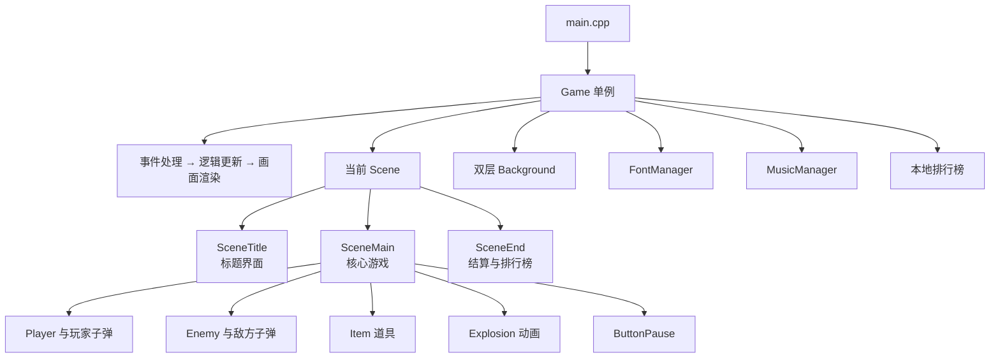
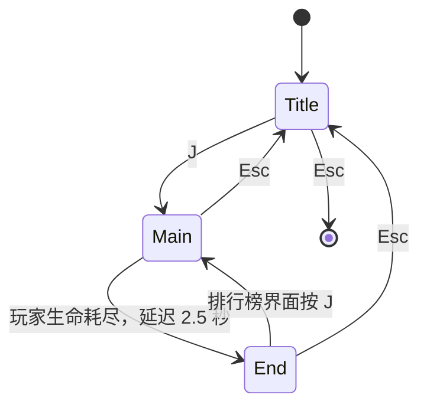

# SDL 太空战机

一款使用 C++17 和 SDL2 编写的纵向太空射击游戏。玩家驾驶战机躲避敌机与追踪弹幕、击落敌人并收集生命道具，在游戏结束后可记录名字并查看本地排行榜。

## 游戏特色

- 基于加速度、阻尼和 `delta time` 的平滑移动，操作不受帧率影响
- 敌机持续生成并向玩家发射瞄准弹
- 玩家与敌机爆炸动画、背景音乐及多种游戏音效
- 双层视差星空背景
- 生命值、实时帧率和得分显示
- 鼠标暂停/继续游戏
- 支持中文输入的游戏结束名称录入
- 本地排行榜持久化，保留最高的 8 条记录

## 操作说明

### 通用操作

| 操作 | 按键 |
| --- | --- |
| 切换全屏/窗口模式 | `F4` |
| 关闭游戏 | 点击窗口关闭按钮 |

### 标题界面

| 操作 | 按键 |
| --- | --- |
| 开始游戏 | `J` |
| 退出游戏 | `Esc` |

### 游戏中

| 操作 | 按键或鼠标 |
| --- | --- |
| 向上、向左、向下、向右移动 | `W`、`A`、`S`、`D` |
| 加速移动 | 按住左 `Shift` |
| 射击 | 按住 `J` |
| 暂停 | 点击右上角暂停按钮 |
| 继续 | 暂停后点击画面中央的继续按钮 |
| 返回标题界面 | `Esc` |

玩家初始拥有 3 点生命。被敌方子弹击中或与敌机相撞会损失生命；击毁敌机后可能掉落生命道具，拾取道具可以恢复生命（不超过生命上限）。

- 击毁一架敌机：获得 20 分
- 拾取一个道具：获得 10 分
- 生命耗尽后：等待爆炸动画结束并进入结算界面

### 结算与排行榜

1. 输入玩家名字，按 `Enter` 保存成绩。名字最多为 10 个字符，留空时使用 `Player`。
2. 在排行榜界面按 `J` 重新开始游戏。
3. 按 `Esc` 返回标题界面。

## 构建与运行

### 环境要求

- 支持 C++17 的编译器
- CMake 3.15 或更高版本
- SDL2
- SDL2_image
- SDL2_mixer
- SDL2_ttf

CMake 需要能够通过 `find_package` 找到以上 SDL2 库及其 CMake 配置文件。

### Windows（Ninja + MSVC）

在 Visual Studio Developer PowerShell 或已经配置好 MSVC 环境的终端中执行：

```powershell
cmake -B build -G Ninja -DCMAKE_BUILD_TYPE=Debug
cmake --build build
cd bin/Debug
.\my_sdl_shooter.exe
```

构建 Release 版本：

```powershell
cmake -B build -G Ninja -DCMAKE_BUILD_TYPE=Release
cmake --build build
cd bin/Release
.\my_sdl_shooter.exe
```

Ninja 是单配置生成器。切换 Debug/Release 时，需要重新运行配置命令并设置对应的 `CMAKE_BUILD_TYPE`。

### Linux（Makefiles）

安装 SDL2 及相关开发包后执行：

```bash
cmake -B build -G "Unix Makefiles" -DCMAKE_BUILD_TYPE=Release
cmake --build build
cd bin/Release
./my_sdl_shooter
```

> [!IMPORTANT]
> 游戏中的资源路径相对于可执行文件写死为 `../../assets/...`，因此必须进入 `bin/Debug` 或 `bin/Release` 后再启动程序。直接从项目根目录运行可执行文件会导致图片、字体和音频加载失败。

## 游戏架构

程序入口为 `src/main.cpp`，通过 `Game::instance()` 初始化 SDL 子系统并进入主循环。`Game` 是整个程序的核心单例，负责窗口、渲染器、场景、背景、资源管理器、排行榜及游戏循环。



### 主循环

`Game::run()` 按以下顺序持续运行：

1. 轮询并分发 SDL 事件。
2. 计算并传递以秒为单位的 `delta time`。
3. 更新视差背景和当前场景。
4. 渲染背景、场景及界面。
5. 以延时配合主动让出线程的方式将帧率限制在 320 FPS。

移动和动画均使用 `delta time` 更新，保证不同机器上的运动速度基本一致。

### 场景系统

所有场景都继承自抽象基类 `Scene`，并实现初始化、事件处理、更新、渲染和清理接口。



- `SceneTitle`：显示标题和闪烁的开始提示，播放标题音乐。
- `SceneMain`：管理玩家、敌机、子弹、物品、爆炸、暂停状态、分数与生命值。
- `SceneEnd`：显示最终得分，处理 UTF-8 名字输入并展示排行榜。

`Game::changeScene()` 会清理旧场景、接管新场景并执行初始化。主游戏场景析构时会把最终得分交给 `Game`，供结算场景读取。

### 游戏对象

核心游戏对象位于 `src/scene_main_object/`：

- `Player`：处理移动、加速、射击、碰撞、生命和玩家子弹。
- `Enemy`：生成敌机并控制其向下移动。
- `PlayerBullet` / `EnemyBullet`：处理双方子弹移动、伤害与碰撞；敌方子弹生成时会瞄准玩家。
- `Explosion`：播放精灵表爆炸动画。
- `Item`：道具抽象基类；目前已实现恢复生命的 `ItemLifeRestoring`。
- `ButtonPause`：渲染暂停按钮并判断鼠标点击区域。

子弹采用“模板对象 + 复制构造”的生成方式，纹理通过智能指针共享，避免为每颗子弹重复加载资源。

### 资源管理

- `FontManager` 按需加载普通字体和标题字体。
- `MusicManager` 按需加载背景音乐与音效。
- SDL 窗口、渲染器、纹理、表面和字体使用带自定义删除器的智能指针管理。
- `Background` 分别绘制远景和近景星层，形成视差滚动效果。
- 排行榜保存在 `assets/leaderboard.data`，保存时附带内容哈希，并在下次启动时校验和读取。

## 项目结构

```text
.
├── assets/                    # 图片、字体、音乐、音效和排行榜数据
├── src/
│   ├── font_manager/          # 字体资源管理
│   ├── music_manager/         # 音乐与音效资源管理
│   ├── scene/                 # 标题、主游戏、结算场景
│   ├── scene_main_object/     # 玩家、敌机、子弹、物品、爆炸等
│   ├── tests/                 # 独立函数实验用 scratchpad
│   ├── background.*           # 视差背景
│   ├── game.*                 # 游戏核心、主循环与全局资源
│   └── main.cpp               # 程序入口
├── CMakeLists.txt
└── README.md
```

各功能子目录构建为静态库，再链接到 `my_sdl_shooter` 可执行程序。新增源文件时，需要同时将其加入对应目录下的 `CMakeLists.txt`。

## 技术栈

- C++17
- CMake
- SDL2
- SDL2_image
- SDL2_mixer
- SDL2_ttf
